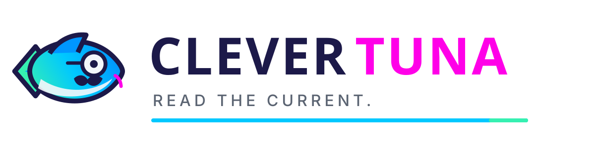
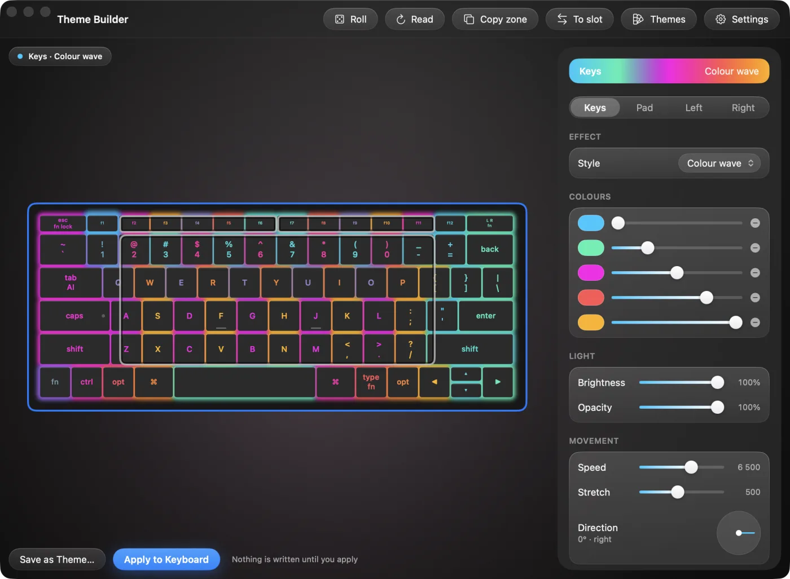
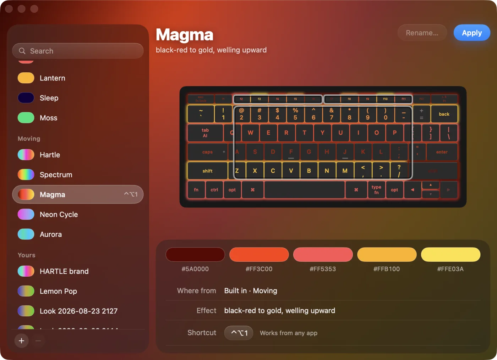
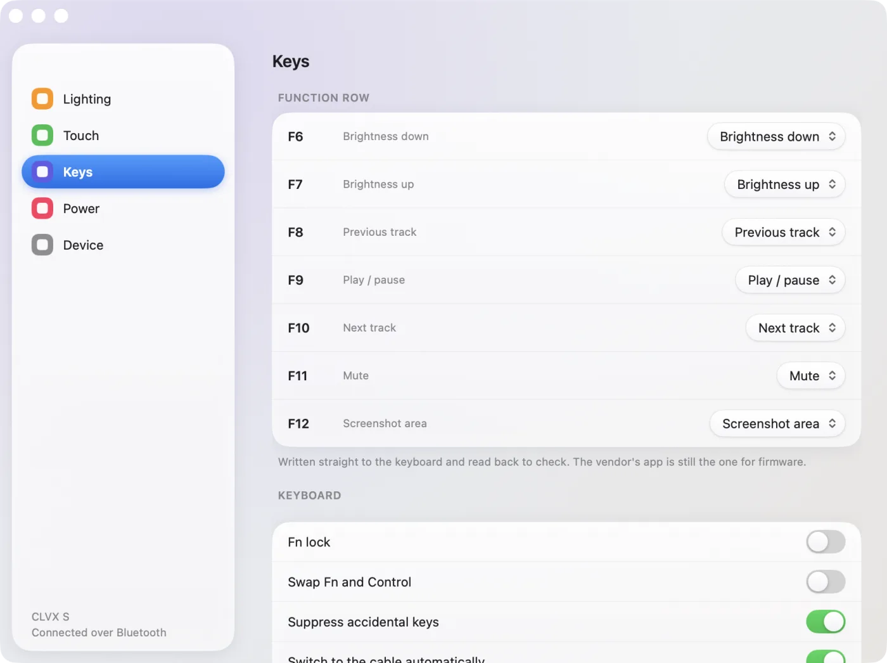

<div align="center">



### Read the current.

**A rather cultivated configurator for Clevetura CLVX keyboards.**<br>
One self-contained binary. No daemon, no account, no telemetry.

[![Badge Site]][Site] [![Badge Download]][Download] [![Badge Licence]][Licence] [![Badge Rust]][Site] [![Badge Deps]][Site] [![Badge Linux]][Site]

---

**[<kbd> <br> Download <br> </kbd>][Download]**
**[<kbd> <br> Docs <br> </kbd>][Docs]**
**[<kbd> <br> Protocol <br> </kbd>][Protocol]**
**[<kbd> <br> Support <br> </kbd>][Support]**

---

<!-- funding:begin -->
<p align="center"><strong>Free, and it stays free.</strong> If it saved you an afternoon, this is where you can say so:</p>
<p align="center"><sub><b>On a platform</b></sub></p>
<p align="center">
  <a href="https://github.com/sponsors/code-hartle-tech"></a>
  <a href="https://patreon.com/HARTLETECH"></a>
  <a href="https://liberapay.com/hartle.tech/donate"></a>
  <a href="https://ko-fi.com/hartletech"></a>
</p>
<p align="center"><sub><b>Direct — HARTLE.TECH accounts</b></sub></p>
<p align="center">
  <a href="https://wise.com/pay/business/hartletechunipessoallda"></a>
  <a href="https://paypal.me/hartletech"></a>
  <a href="https://buy.stripe.com/5kQ8wR3Wm1sjbKW15E9fW01"></a>
</p>
<!-- funding:end -->



</div>

## Why

Your colour scheme lives in the keyboard, and the vendor app has no export and
no import. Worse, it **overwrites its own config from the keyboard every time
it connects**, so copying its settings file between machines achieves nothing.

Clevertuna makes the scheme a file.

```bash
clevertuna get-backlight mine.json     # take what the keyboard has
#  … send mine.json to a friend …
clevertuna set-backlight mine.json     # and it looks like yours
```

## What it does

- 🎨 **Lighting for all four zones** — keys, touchpad, both touch sliders
- 💾 **Themes as files** — save one, send it, put it back
- 🖼 **Wallpaper matching** — a scheme built from your desktop picture
- ⏰ **Scheduled changes** — hourly, daily, or one look by day and another by night
- 📋 **Clone to every slot** — the cable and all three Bluetooth channels
- ⌨️ **Remaps the function row** — which nothing else on Linux can do
- 🔌 **USB and Bluetooth** — the vendor app is cable-only
- ✅ **Every write is read back** and compared before it reports success

## Install

**macOS** — [download the app][Download], then **right-click → Open** the first
time. macOS 26+.

**Linux** — `cargo build --release`. No crates to fetch.
[Add the udev rule][Install] so it works without `sudo`.

## Look

<div align="center">
 
</div>

## Docs

| | |
|---|---|
| [Install][Install] | macOS, Linux, udev, Windows |
| [Usage][Docs] | every command, window and flag |
| [Themes][Themes] | the fifteen, the randomiser, the scheme file |
| [Safety][Safety] | what "verified" means, and exit codes |
| [Protocol][Protocol] | the wire format, reverse-engineered |
| [Hardware log][Hardware] | what has actually been run against a keyboard |

## Licence

Apache-2.0 · © HARTLE.TECH · [contact@hartle.tech](mailto:contact@hartle.tech)

[`NOTICE`](NOTICE) records how the wire format was determined: an independent
implementation of a protocol for interoperability, so that people who own the
hardware can move their own settings between their own machines. No vendor code
is included or redistributed.

Clevertuna is **not affiliated with, endorsed by, or supported by Clevetura**.
"Clevetura", "CLVX" and "TouchOnKeys" belong to their owner.

<!-------------------------------- Links -------------------------------->

[Site]: https://clevertuna.hartle.tech
[Download]: https://github.com/hartle-tech/clevertuna/releases/latest
[Licence]: LICENSE
[Support]: https://clevertuna.hartle.tech/#support

[Docs]: docs/USAGE.md
[Install]: docs/INSTALL.md
[Themes]: docs/THEMES.md
[Safety]: docs/SAFETY.md
[Protocol]: docs/PROTOCOL.md
[Hardware]: docs/HARDWARE-VERIFICATION.md

<!-------------------------------- Badges ------------------------------->

[Badge Site]: https://img.shields.io/badge/clevertuna.hartle.tech-00C8FF?style=for-the-badge&labelColor=07101F
[Badge Download]: https://img.shields.io/badge/download-macOS-36F0B1?style=for-the-badge&labelColor=07101F
[Badge Licence]: https://img.shields.io/badge/Apache--2.0-00C8FF?style=for-the-badge&labelColor=07101F
[Badge Rust]: https://img.shields.io/badge/Rust-00C8FF?style=for-the-badge&logo=rust&logoColor=white&labelColor=07101F
[Badge Deps]: https://img.shields.io/badge/dependencies-zero-36F0B1?style=for-the-badge&labelColor=07101F
[Badge Linux]: https://img.shields.io/badge/Linux-x86__64-FFB100?style=for-the-badge&logo=linux&logoColor=white&labelColor=07101F
